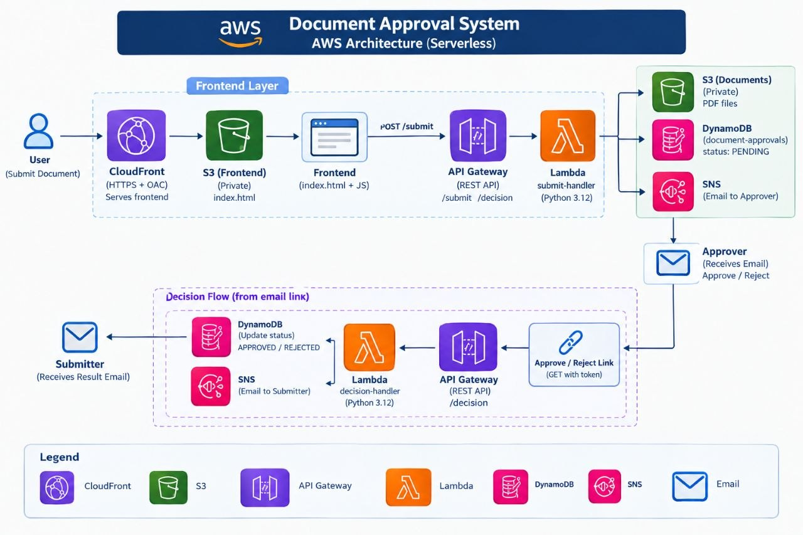

<a id="top"></a>

# 🧠 Design Concepts — AWS Serverless Document Approval System

> A clean explanation of the architecture, AWS services, security decisions and approval workflow used in the project.

---

## 📋 Quick Navigation

| Topic | What it covers |
|---|---|
| 🏗 [Architecture](#architecture) | Complete system architecture |
| 🌍 [Frontend Delivery](#frontend) | S3, CloudFront and OAC |
| 📤 [Document Submission](#submission) | Upload and notification flow |
| ✅ [Approval / Rejection](#decision) | Decision processing |
| 🗃 [DynamoDB](#dynamodb) | Document state and transitions |
| 📣 [SNS](#sns) | Email notification layer |
| ⚡ [Serverless Design](#serverless) | Why managed/serverless services |
| 🔌 [API Gateway](#api) | API routes and role |
| 🔑 [Approval Token](#token) | Per-document decision authorization |
| 🔒 [Security](#security) | Main security controls |
| 🛡 [IAM](#iam) | Least-privilege access |
| 💰 [Cost](#cost) | Cost considerations |

---

<a id="architecture"></a>

## 🏗 Architecture



The project is built as a serverless approval workflow. Each AWS service has one clear responsibility.

```text
User
  ↓
CloudFront + OAC
  ↓
Private S3
  ↓
API Gateway
  ↓
submit-handler
  ├── S3
  ├── DynamoDB
  └── SNS
       ↓
  Approver Email
       ↓
 Approve / Reject
       ↓
 GET /decision
       ↓
 decision-handler
       ↓
 DynamoDB
```

The document starts in `PENDING` and can then move to `APPROVED` or `REJECTED`.

---

<a id="frontend"></a>

## 🌍 Frontend Delivery — S3 + CloudFront + OAC

The frontend is a static website, so its files are stored in Amazon S3.

The S3 frontend bucket is kept **private**. CloudFront is the public delivery layer.

```text
Internet
   ↓
CloudFront
   ↓
Origin Access Control (OAC)
   ↓
Private S3 Bucket
```

### Why CloudFront?

CloudFront provides the public HTTPS delivery layer for the frontend and can cache static files close to users.

### Why OAC?

OAC allows CloudFront to access the private S3 bucket without making the bucket publicly readable.

This means the intended path is:

```text
User → CloudFront → S3
```

rather than allowing direct public access to the S3 objects.

### Why no S3 Static Website Hosting?

The project uses the S3 REST origin with CloudFront/OAC. Static website hosting is therefore not required for the private-bucket design.

---

<a id="submission"></a>

## 📤 Document Submission Flow

When a user submits a PDF, the request follows this path:

```text
Frontend
   ↓
POST /submit
   ↓
API Gateway
   ↓
submit-handler
   ↓
┌───────────────┬────────────────┬────────────────┐
│               │                │                │
▼               ▼                ▼                ▼
S3           DynamoDB          SNS          Approval Email
PDF           PENDING        Notification       │
                                                 │
                                                 ▼
                                         Approve / Reject
```

The `submit-handler` is responsible for the submission logic. It stores the document, creates the approval record and sends the notification.

---

<a id="decision"></a>

## ✅ Approval / Rejection Flow

The approver receives links for the two possible decisions.

The links reach:

```text
GET /decision
```

with the document ID, token and requested action.

The request is then processed by `decision-handler`.

```text
Approver
   ↓
Approve / Reject link
   ↓
API Gateway
   ↓
decision-handler
   ↓
Validate request
   ↓
Check token + current status
   ↓
Update DynamoDB
   ↓
APPROVED / REJECTED
```

The separation between `submit-handler` and `decision-handler` keeps the two parts of the workflow independent.

---

<a id="dynamodb"></a>

## 🗃 DynamoDB — Workflow State

DynamoDB stores the document approval record.

The main identifier is:

```text
doc_id
```

The document also has an approval state.

```text
PENDING
APPROVED
REJECTED
```

The state transition is:

```text
             ┌───────────┐
             │  PENDING  │
             └─────┬─────┘
                   │
            ┌──────┴──────┐
            │             │
         Approve        Reject
            │             │
            ▼             ▼
       ┌──────────┐  ┌──────────┐
       │ APPROVED │  │ REJECTED │
       └──────────┘  └──────────┘
```

The decision function checks the current state before changing it. This prevents a document that is no longer pending from being treated as a new approval decision.

---

<a id="sns"></a>

## 📣 SNS — Email Notifications

Amazon SNS is used as the managed notification layer.

```text
Lambda
   ↓
SNS Topic
   ↓
Email Subscription
   ↓
Approver / configured recipient
```

The main benefit is that the project does not need to run or manage its own email server.

SNS is used to notify the approver about a new document and to support the configured result-notification flow.

---

<a id="serverless"></a>

## ⚡ Serverless Design

The project does not use EC2, an application server or a load balancer.

Instead, the application uses managed services that execute when needed:

```text
API Gateway
     ↓
   Lambda
     ↓
S3 / DynamoDB / SNS
```

### Benefits in this project

- No server administration.
- No operating-system maintenance.
- Lambda runs the application logic on demand.
- S3 and DynamoDB provide managed storage.
- SNS provides managed notifications.

---

<a id="api"></a>

## 🔌 API Gateway

API Gateway is the HTTP entry point for the backend.

The project uses two main routes:

```text
POST /submit
GET  /decision
```

### `POST /submit`

Used by the frontend to submit the document.

### `GET /decision`

Used by the Approve / Reject links sent in the email.

Using API Gateway keeps the frontend separate from the Lambda implementation and gives the project a clear API layer.

---

<a id="token"></a>

## 🔑 Approval Token

Each approval request uses a document ID together with a per-document token.

Conceptually:

```text
doc_id + token + action
          ↓
   decision-handler
          ↓
       DynamoDB
```

The decision Lambda verifies that the token corresponds to the requested document before processing the action.

### Important distinction

The approval token is **not a full user authentication system**. It is part of the mechanism used to authorize the specific document decision.

For a larger production system, stronger controls could be added, such as authenticated approvers, token expiration and one-time-use tokens.

---

<a id="security"></a>

## 🔒 Security Decisions

### Private S3 bucket

The frontend bucket is not publicly readable. CloudFront/OAC is used as the access path.

### HTTPS

CloudFront redirects HTTP requests to HTTPS.

### Restricted CORS

The frontend origin is set to the real CloudFront domain instead of:

```text
*
```

CORS controls which browser origins are allowed to make cross-origin requests. It does not replace backend authorization.

### Input validation

The Lambda functions validate incoming data before processing it.

### Approval state validation

The decision function checks the current DynamoDB status before applying a new decision.

---

<a id="iam"></a>

## 🛡 IAM — Least Privilege

Lambda accesses AWS resources through IAM execution roles.

The goal is:

```text
Required actions
      +
Required resources
      =
Least privilege
```

The permissions should be limited to what each Lambda actually needs, such as access to the relevant S3 bucket, DynamoDB table, SNS topic and CloudWatch Logs.

Least privilege reduces the potential impact if a function or its credentials are ever misused.

---

<a id="cost"></a>

## 💰 Cost Considerations

The architecture is serverless, but serverless does not mean that every resource is permanently free.

Potential usage-based charges can come from:

- S3 storage and requests
- CloudFront data transfer and requests
- API Gateway requests
- Lambda execution
- DynamoDB usage
- SNS usage

For a small learning project, the workload can remain very low. Billing should still be monitored.

---

<div align="center">

[⬆️ Back to top](#top)

</div>
