<div align="center">

# 🛠️ Build Log — AWS Serverless Document Approval System

A record of the resources created and the configuration used to build the document approval workflow.


</div>

---

### Contents
- 🗃️ [DynamoDB — Approval State](#️-dynamodb--approval-state)
- 📣 [SNS — Approval Notifications](#-sns--approval-notifications)
- 🔐 [IAM — Lambda Execution Role](#-iam--lambda-execution-role)
- 🪣 [S3 — Document Storage](#️-s3--document-storage)
- ⚡ [Lambda — submit-handler](#-lambda--submit-handler)
- ⚡ [Lambda — decision-handler](#-lambda--decision-handler)
- 🔌 [API Gateway](#-api-gateway)
- 🌐 [Frontend — S3 Bucket](#-frontend--s3-bucket)
- 🌍 [CloudFront + OAC](#-cloudfront--oac)
- 📤 [Frontend Upload](#-frontend-upload)
- 🔧 [Environment Variables + CORS](#-environment-variables--cors)
- ✅ [End-to-End Test](#-end-to-end-test)

---

## 🗃️ DynamoDB — Approval State

| Field | Value |
|:---|:---|
| Table | `document-approvals` |
| Partition key | `doc_id` (String) |
| Capacity mode | On-demand |
| Initial state | `PENDING` |

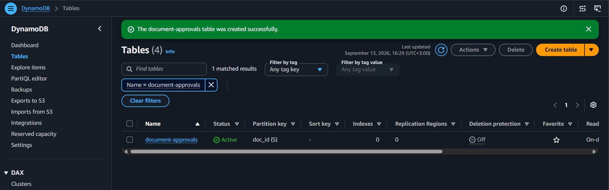

---

## 📣 SNS — Approval Notifications

| Field | Value |
|:---|:---|
| Topic | `approval-notifications` |
| Type | Standard |
| Protocol | Email |

> The email subscription must be confirmed before notifications will actually deliver.

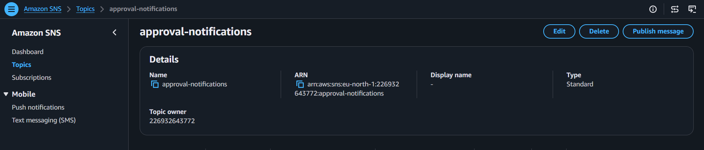

---

## 🔐 IAM — Lambda Execution Role

Scoped access to what the functions actually use:

`CloudWatch Logs` · `S3` · `DynamoDB` · `SNS`

Permissions are limited to the specific resources and actions each function needs — not broad service-level access.

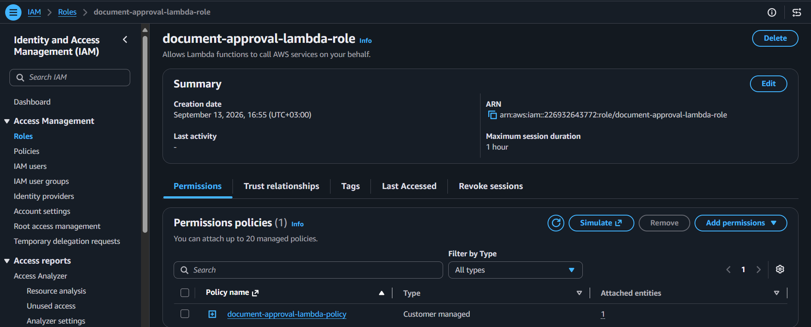

---

## 🪣 S3 — Document Storage

Private bucket for uploaded PDFs — not publicly readable at any point in the flow.

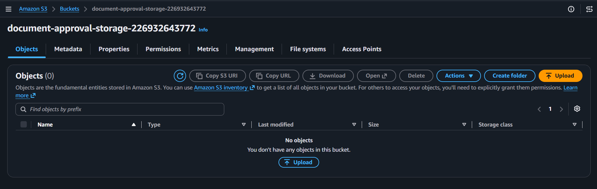

---

## ⚡ Lambda — submit-handler

| Field | Value |
|:---|:---|
| Function | `submit-handler` |
| Runtime | Python 3.12 |

```
Validate request
      ↓
Store PDF in S3
      ↓
Create DynamoDB record
      ↓
Set status = PENDING
      ↓
Publish SNS approval notification
```

**Environment variables:** `TABLE_NAME` · `TOPIC_ARN` · `APP_BASE_URL` · `ALLOWED_ORIGIN`

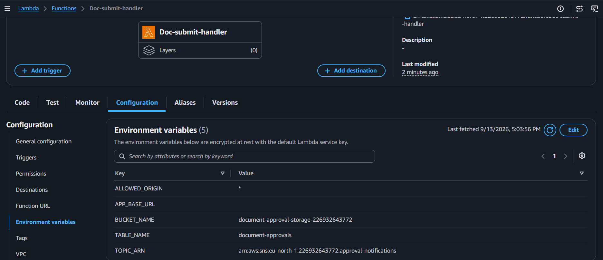

---

## ⚡ Lambda — decision-handler

| Field | Value |
|:---|:---|
| Function | `decision-handler` |
| Runtime | Python 3.12 |
| Request fields | `doc_id`, `token`, `action` |
| Allowed actions | `approve`, `reject` |

Validates the document, token, action, and current state before updating DynamoDB.

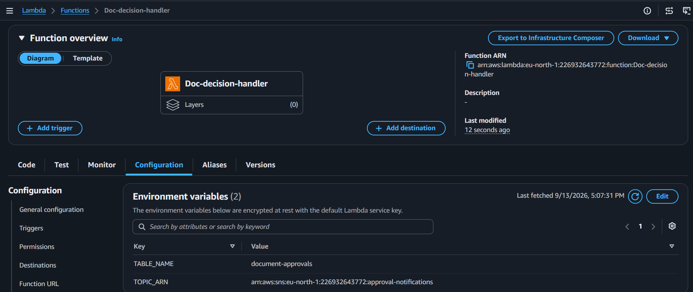

---

## 🔌 API Gateway

| Route | Purpose |
|:---|:---|
| `POST /submit` | Frontend submits a new document |
| `GET /decision` | Approve/Reject links resolve the decision |

The API Gateway Invoke URL is used as the base URL for the approval links.

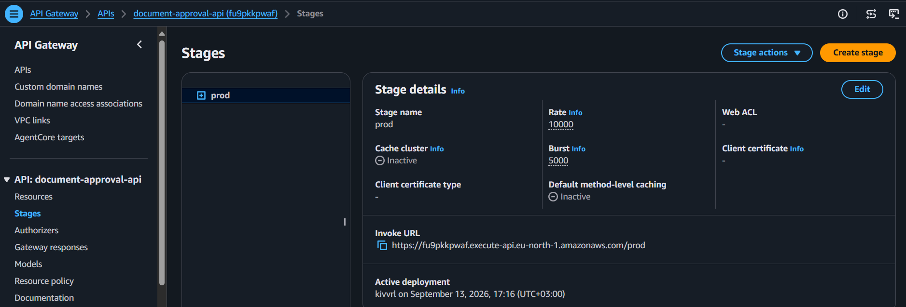

---

## 🌐 Frontend — S3 Bucket

Static files (`index.html`, `style.css`, `script.js`) sit in a private bucket. CloudFront is the only public entry point.

---

## 🌍 CloudFront + OAC

| Setting | Value |
|:---|:---|
| Origin type | Amazon S3 — frontend bucket |
| Private S3 access | Enabled via Origin Access Control (OAC) |
| Origin settings | Recommended defaults |
| Cache settings | Recommended (S3 content) |
| Viewer protocol policy | Redirect HTTP → HTTPS |
| Default root object | `index.html` |

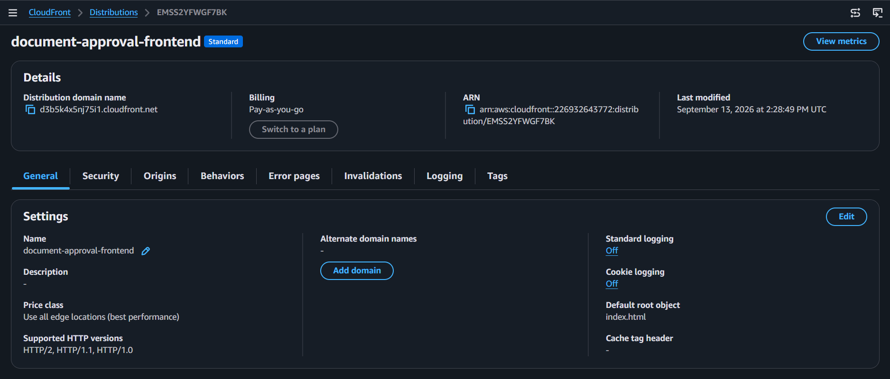

CloudFront/OAC is the trusted path for reading the private frontend bucket — the S3 bucket policy reflects that.

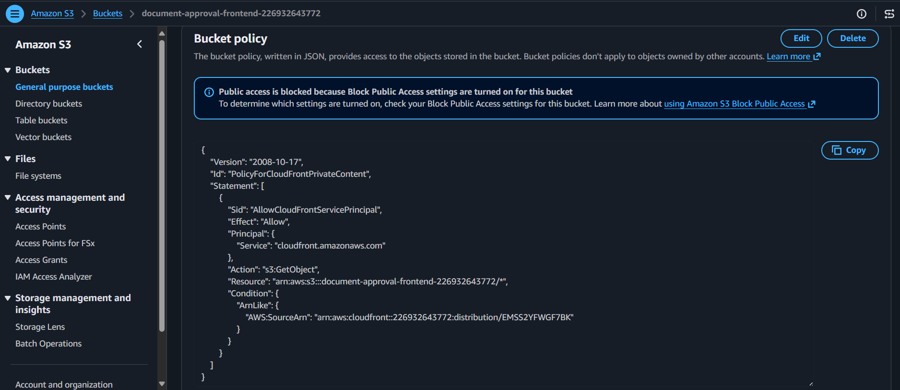

---

## 📤 Frontend Upload

Frontend files uploaded to the bucket. The bucket is never made public to serve the site — CloudFront + OAC stays the only access path.

---

## 🔧 Environment Variables + CORS

Set once the API Gateway and CloudFront URLs exist:

| Variable | Value | Why |
|:---|:---|:---|
| `APP_BASE_URL` | API Gateway Invoke URL | Approval links point to `/decision` on this API |
| `ALLOWED_ORIGIN` | CloudFront domain | Represents the actual browser origin allowed to call the API |

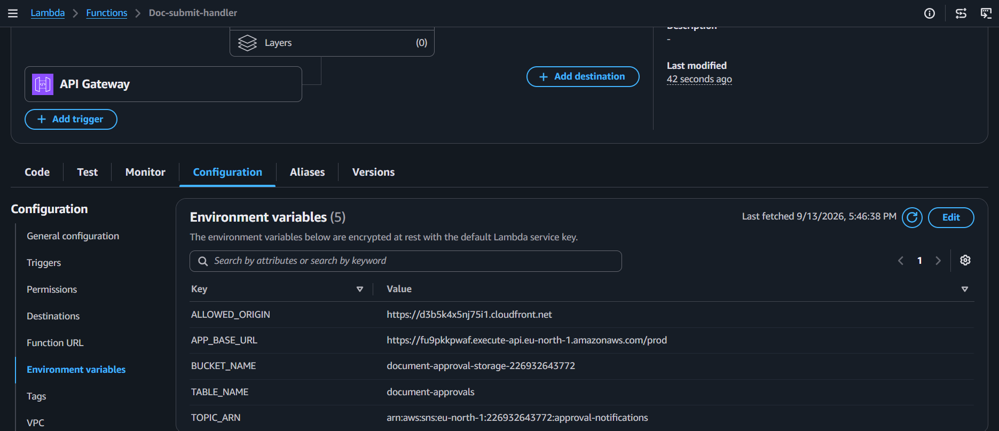

---

## ✅ End-to-End Test

<div align="center">

| Check | Result |
|:---:|:---:|
| Submit | 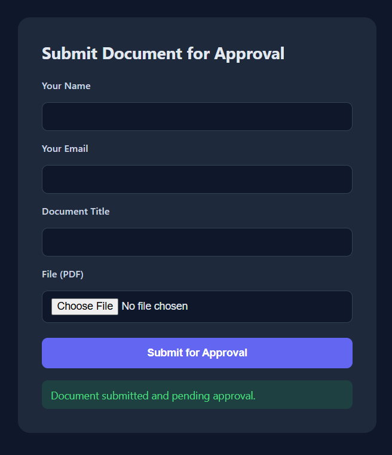 |
| Approval email | 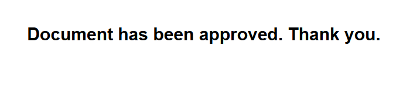 |
| Decision page |  |
| DynamoDB status | 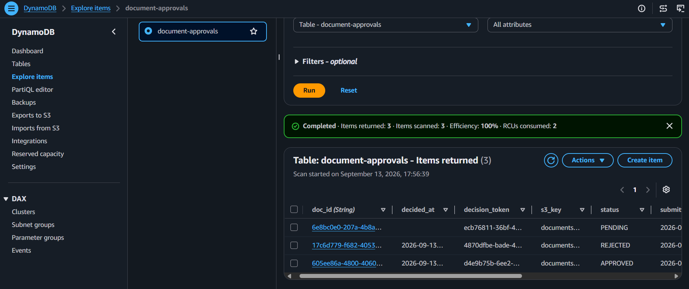 |
| S3 | 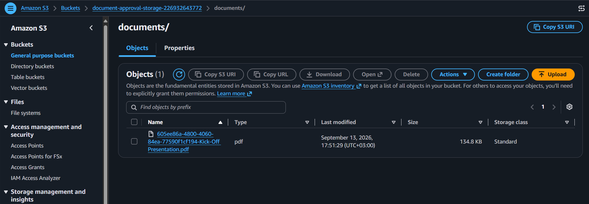 |

</div>

State path confirmed: `PENDING → APPROVED` or `PENDING → REJECTED`.
